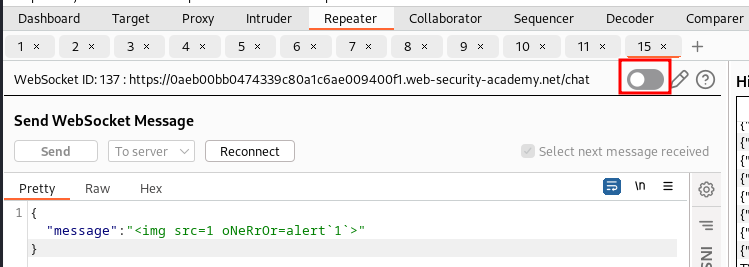
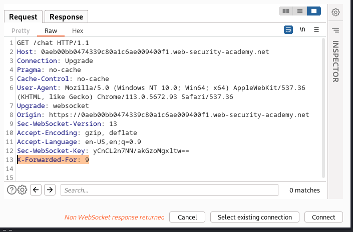

# WebSockets

## Manipulating WebSocket messages to exploit vulnerabilities

The sent via browser automatically get encoded. To trigger an XSS alert message 
we can send this unfiltered payload through burp repeater.

``` json
{ "message":  }
```

## Manipulating the WebSocket handshake to exploit vulnerabilities

To work around the ip block we need to set the `X-Forwarded-For` header:  
  


For the XSS payload:

``` json
{ "message":"" }
```
